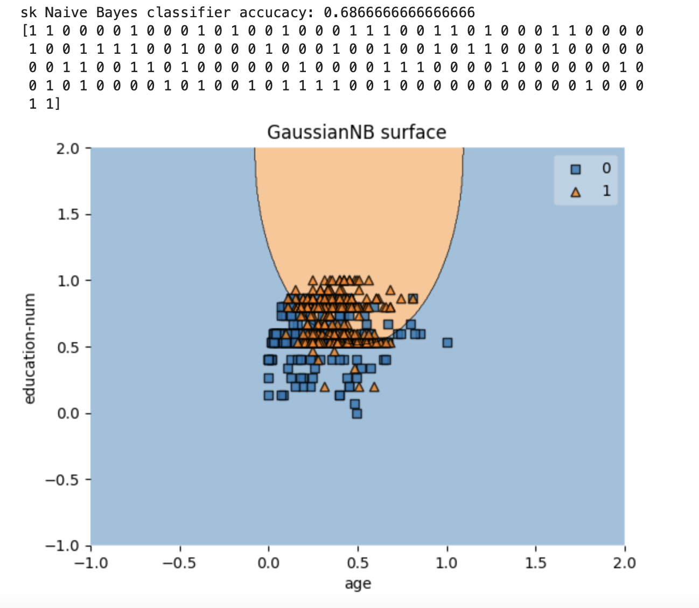

# Наивный байесовский классификатор

Проект по реализации и исследованию наивного байесовского классификатора для решения двух задач: классификации текстов и прогнозирования доходов на основе данных переписи населения.

## Цели и задачи

**Цель:** Изучение вероятностного классификатора на основе формулы Байеса.

**Основные задачи:**
- Изучение принципов работы алгоритма наивного байесовского классификатора
- Изучение метода максимального правдоподобия
- Получение навыков анализа данных, используя наивный байесовский классификатор

## Технологический стек

### Основные технологии
- **Python 3.7+** - основной язык программирования
- **Jupyter Notebook** - интерактивная среда разработки и анализа

### Обработка естественного языка (NLP)
- **NLTK (Natural Language Toolkit)** - библиотека для обработки естественного языка
  - `nltk.tokenize.sent_tokenize` - токенизация предложений
  - `nltk.tokenize.word_tokenize` - токенизация слов
- **Регулярные выражения (re)** - предобработка текстовых данных

### Анализ данных и манипуляции
- **Pandas** - обработка и анализ структурированных данных
- **NumPy** - научные вычисления и работа с массивами
- **Collections.Counter** - подсчет частот слов

### Машинное обучение
- **Scikit-learn** - библиотека машинного обучения
  - `GaussianNB` - наивный байесовский классификатор
  - `train_test_split` - разделение данных на обучающую и тестовую выборки
  - `accuracy_score` - оценка точности модели
- **MLxtend** - дополнительные инструменты для ML
  - `plot_decision_regions` - визуализация границ принятия решений

### Визуализация
- **Matplotlib** - создание статических и интерактивных визуализаций
- **Seaborn** - статистическая визуализация данных

## Задание 1: Классификация текстов

Подберите по 10 и более предложений из текстов по разным областям. Реализуйте
простейший частотный байесовский классификатор для классификации входящего
предложения к одной из двух областей.

Для выполнения задания были выбраны два текста из двух различных областей. 

### Данные
- **text1.txt**: Краткая справка о шведской поп-группе ABBA (10 предложений)
- **text2.txt**: Обзор статистики как науки (16 предложений)

### Математическая модель
$P(C|M) = P(C) \cdot \prod_{i=1}^n P(w_i|C), \ \ w_i \in M$

Где:
- $C \in (text1, \ \ text2)$ - классы текстов
- $M$ - классифицируемое предложение
- $w_i$ - i-е слово в предложении $M$
- $P(text1) = \frac{10}{26} = 0.385$
- $P(text2) = \frac{16}{26} = 0.615$

## Задание 2.
Подберите набор данных на ресурсе https://archive.ics.uci.edu/ для классификации

Для реализации модели классификации был выбран набор данных **Census Income Dataset**. Набор данных используется для задач анализа данных и машинного обучения. Этот набор был собран из данных переписи населения США и используется для исследования задач оценки дохода.

**Источник:** UCI Machine Learning Repository.

**Цель:** Предсказать, получает ли человек доход выше 50,000 долларов в год.
Использован **Census Income Dataset** с ресурса UCI Machine Learning Repository.

### Признаки набора данных

**Числовые признаки:**
- `age`: Возраст
- `fnlwgt`: Вес выборки
- `capital-gain`: Прибыль от капитала
- `capital-loss`: Убыток от капитала
- `hours-per-week`: Часов работы в неделю

**Категориальные признаки:**
- `workclass`: Категория занятости
- `education`: Уровень образования
- `education-num`: Числовой эквивалент образования
- `marital-status`: Семейное положение
- `occupation`: Род занятий
- `relationship`: Семейные отношения
- `race`: Раса
- `sex`: Пол
- `native-country`: Страна происхождения

**Целевой признак:**
- `income`: Доход (<=50K или >50K)

## Задание 3.

Реализуйте модель классификации по байесовскому классификатору и оцените полученные результаты.

### Предобработка данных
- Преобразование категориальных данных в числовой формат
- Нормализация числовых переменных
- Разделение на обучающую и тестовую выборки

### Результаты
- **Точность модели:** ≈0.69 (69%)
- Модель правильно классифицировала 69% тестовой выборки

### Визуализация

Анализ decision boundary показал, что:
- К высокооплачиваемому классу (>50K) относятся люди среднего возраста
- Образование среднее и выше среднего является значимым фактором
- Модель демонстрирует некоторые ошибки классификации на границах классов

